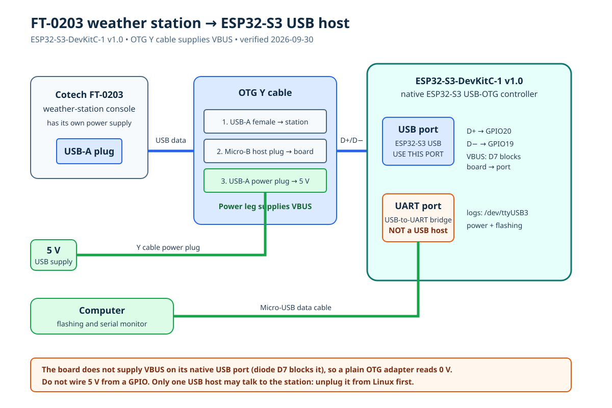

# FT-0203 USB host wiring — ESP32-S3-DevKitC-1 v1.0

> **Verified working (2026-09-30):** The DevKitC-1 v1.0 does not supply VBUS
> on its native `USB` port: schematic diode D7 (1N5819) only lets the port
> power the board, so an OTG adapter alone reads 0 V and nothing enumerates.
> An **OTG Y cable** (Micro-B host plug, USB-A female for the station, and a
> second USB-A plug for 5 V) fixes this. With it, the ESP32-S3 enumerated the
> FT-0203 as `1130:0829`, full speed, HID, endpoints IN `0x83` / OUT `0x04`.
> Supply the Y cable's power plug from a normal USB 5 V source; do not wire 5 V
> into the cable from a GPIO.

The **ESP32-S3-DevKitC-1 v1.0** has two Micro-USB connectors. They have
different jobs:

- **`UART` / USB-to-UART port:** use this to power the development board and
  to flash it or view serial logs from a computer.
- **`USB` / ESP32-S3 USB port:** use this for the weather station. It is wired
  directly to the ESP32-S3's USB-OTG peripheral.

Do **not** attach the weather station to the `UART` port: that port terminates
at the USB-to-UART bridge and cannot act as a USB host.

## Parts and connections

| Item | Connection |
| --- | --- |
| FT-0203 console USB plug | The console's USB-A plug goes into the USB-A female end of the OTG Y cable. |
| OTG Y cable | Micro-B **host** plug into the board's port labelled `USB` / `ESP32-S3 USB`. Its second USB-A plug goes to a 5 V USB supply and provides VBUS. |
| Board power and programming | Connect a normal Micro-USB data cable from the `UART` port to a computer, or connect it to a regulated 5 V USB supply. |

There are no Dupont data wires to connect. The native USB connector already
routes the required signals internally:

| USB signal | ESP32-S3 connection |
| --- | --- |
| D+ | GPIO20 (`USB_D+`) |
| D- | GPIO19 (`USB_D-`) |
| VBUS | **Not supplied by the board.** Provided by the OTG Y cable's power plug |
| GND | Board ground |

The ESP32-S3 USB host stack sets host mode in firmware; an adapter's OTG ID
pin is not a substitute for this. The station's separate power supply does
not guarantee that its USB device interface will enumerate without VBUS.

## Power and safety

1. Start with the board powered through its **`UART`** connector and the
   weather station unplugged. Flash the USB-host smoke-test firmware first.
2. With the firmware running, plug the OTG adapter into the native **`USB`**
   connector, then plug in the FT-0203 console.
3. The host side must provide 5 V on USB VBUS. Having 5 V at the board's power
   pin does **not** prove the native USB connector is supplying it. A USB
   power tester showed no VBUS at the OTG adapter and no USB device enumerated.
   **Resolve host-side VBUS before testing more devices.** Use a purpose-built
   USB host VBUS supply/switch arrangement with backfeed protection, or an
   ESP32-S3 board with a dedicated powered host port. A powered hub alone may
   not work because it still needs upstream VBUS. Never source VBUS from a
   GPIO or an improvised cable splice.
4. Never connect the FT-0203 to a laptop/Linux USB port at the same time as it
   is connected to the ESP32. Only one USB host may control it.
5. If VBUS is present but the station repeatedly disconnects or the board
   browns out, stop and consider a powered USB 2.0 hub between the OTG adapter
   and station. A hub does not necessarily fix **absent upstream VBUS**.

The FT-0203 is a full-speed HID device (VID:PID `1130:0829`). The ESP32-S3's
native full-speed USB-OTG interface is the correct controller for it.

## References

- [Espressif ESP32-S3-DevKitC-1 v1.0 user guide](https://docs.espressif.com/projects/esp-dev-kits/en/latest/esp32s3/esp32-s3-devkitc-1/user_guide_v1.0.html)
- [Board schematic (v1.0)](https://dl.espressif.com/dl/SCH_ESP32-S3-DEVKITC-1_V1_20210312C.pdf)
